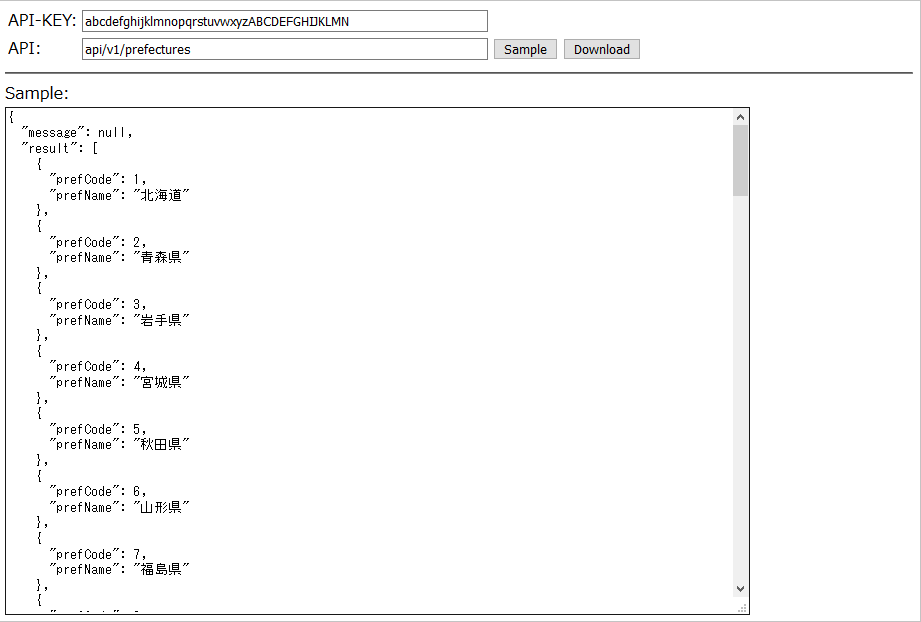

# resas-download
RESAS APIを手軽に実行するHTMLファイル

## 使い方
- `index.html`をローカルにコピーし、ブラウザで開く。
- `API-KEY`にAPIキーを入力する。
- https://opendata.resas-portal.go.jp/ に続くURLを `API` に入力し、ボタンで実行。

## リンク
- [RESAS-API](https://opendata.resas-portal.go.jp/)
  - APIキー発にはアカウント登録が必要
- [RESAS-API仕様書](https://opendata.resas-portal.go.jp/docs/api/v1/index.html)
